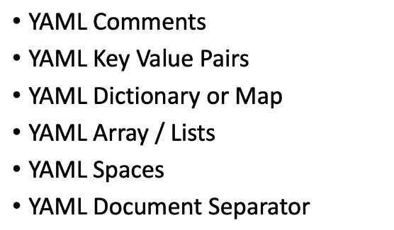

# YAML Basics




## Step-01: Comments & Key Value Pairs

- Space after colon is mandatory to differentiate key and value

```yml
# Defining simple key value pairs
name: kalyan
age: 23
city: Hyderabad
```

## Step-02: Dictionary / Map

- Set of properties grouped together after an item
- Equal amount of blank space required for all the items under a dictionary

```yml
person:
  name: kalyan
  age: 23
  city: Hyderabad
```

## Step-03: Array / Lists

- Dash indicates an element of an array

```yml
person: # Dictionary
  name: kalyan
  age: 23
  city: Hyderabad
  hobbies: # List
    - cycling
    - cookines
  hobbies: [cycling, cooking]   # List with a differnt notation
```

## Step-04: Multiple Lists

- Dash indicates an element of an array

```yml
person: # Dictionary
  name: kalyan
  age: 23
  city: Hyderabad
  hobbies: # List
    - cycling
    - cooking
  hobbies: [cycling, cooking]   # List with a differnt notation
  friends: #
    - name: friend1
      age: 22
    - name: friend2
      age: 25
```

## Step-05: Sample Pod Tempalte for Reference

```yml
apiVersion: v1 # String
kind: Pod # String
metadata: # Dictionary
  name: myapp-pod
  labels: # Dictionary
    app: myapp
spec:
  containers: # List
    - name: myapp
      image: stacksimplify/kubenginx:1.0.0
      ports:
        - containerPort: 80
          protocol: "TCP"
        - containerPort: 81
          protocol: "TCP"
```
