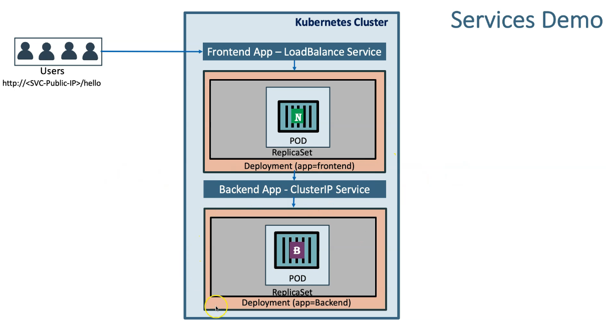

# Services with YAML



## Step-01: Introduction to Services

- We are going to look in to below two services in detail with a frotnend and backend example
  - LoadBalancer Service
  - ClusterIP Service

## Step-02: Create Backend Deployment & Cluster IP Service

- Write the Deployment template for backend REST application.
- Write the Cluster IP service template for backend REST application.
- **Important Notes:**
  - Name of Cluster IP service should be `name: my-backend-service` because same is configured in frontend nginx reverse proxy `default.conf`.
  - Test with different name and understand the issue we face
  - We have also discussed about in our section [03-04-Services-with-kubectl](https://github.com/stacksimplify/azure-aks-kubernetes-masterclass/tree/master/03-Kubernetes-Fundamentals-with-kubectl/03-04-Services-with-kubectl)

```
cd 04-05-Services-with-YAML/kube-manifests
kubectl get all
kubectl apply -f 01-backend-deployment.yml -f 02-backend-clusterip-service.yml
kubectl get all

kubectl get pods
kubectl get svc
```

## Step-03: Create Frontend Deployment & LoadBalancer Service

- Write the Deployment template for frontend Nginx Application
- Write the LoadBalancer service template for frontend Nginx Application

```
cd 04-05-Services-with-YAML/kube-manifests
kubectl get all
kubectl apply -f 03-frontend-deployment.yml -f 04-frontend-LoadBalancer-service.yml
kubectl get all
```

- **Access REST Application**

```
# Get Service IP
kubectl get svc

# Access REST Application
http://<Load-Balancer-Service-IP>/hello
```

## Step-04: Delete & Recreate Objects using kubectl apply

### Delete Objects (file by file)

```
kubectl delete -f 01-backend-deployment.yml -f 02-backend-clusterip-service.yml -f 03-frontend-deployment.yml -f 04-frontend-LoadBalancer-service.yml
kubectl get all
```

### Recreate Objects using YAML files in a folder

```
cd 04-05-Services-with-YAML/
kubectl apply -f kube-manifests/
kubectl get all
```

### Delete Objects using YAML files in folder

```
cd 04-05-Services-with-YAML/
kubectl delete -f kube-manifests/
kubectl get all
```

## Additional References - Use Label Selectors for get and delete

- [Labels](https://kubernetes.io/docs/concepts/cluster-administration/manage-deployment/#using-labels-effectively)
- [Labels-Selectors](https://kubernetes.io/docs/concepts/overview/working-with-objects/labels/#label-selectors)
