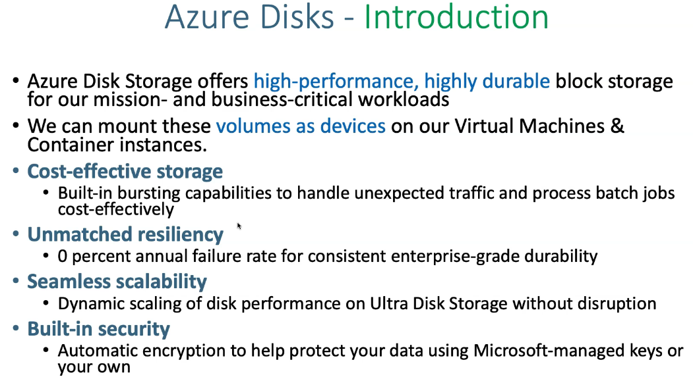
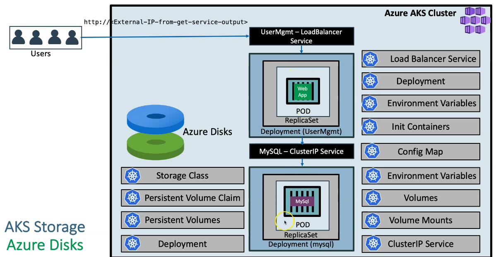

# AKS Storage - Storage Classes, Persistent Volume Claims




## Step-01: Introduction

- We are going to create a MySQL Database with persistence storage using **Azure Disks**

| Kubernetes Object                                        | YAML File                       |
| -------------------------------------------------------- | ------------------------------- |
| Storage Class                                            | 01-storage-class.yml            |
| Persistent Volume Claim                                  | 02-persistent-volume-claim.yml  |
| Config Map                                               | 03-UserManagement-ConfigMap.yml |
| Deployment, Environment Variables, Volumes, VolumeMounts | 04-mysql-deployment.yml         |
| ClusterIP Service                                        | 05-mysql-clusterip-service.yml  |

## Step-02: Create following Kubernetes manifests

### Create Storage Class manifest

- https://kubernetes.io/docs/concepts/storage/storage-classes/#volume-binding-mode
- https://kubernetes.io/docs/concepts/storage/storage-classes/#azure-disk

### Create Persistent Volume Claims manifest

```
# Create Storage Class & PVC
kubectl apply -f kube-manifests/01-storage-class.yml
kubectl apply -f kube-manifests/02-persistent-volume-claim.yml

# List Storage Classes
kubectl get sc
# azurefile, azurefile-premium, default, managed-premium

# List PVC
kubectl get pvc
# initially pending due to WaitForFirstConsumer

# List PV
kubectl get pv
```


even if azure workloads are deleted and underlying PVC(persistant volume claim) deleted, still azure disk should be retained until kubernetes cluster is deleted. if kube cluster deleted, automatically storage class also gets deleted

this is why use custom storage class like managed-premium instead of default.

- WaitForFirstConsumer: will only creates after pod deployed
  - benefit: when we use immediate without waiting for first consumer, then for example if mysql pods deployed then it created in reagion A, then db might be depoyed in another region. so low latancy solved

### Create ConfigMap manifest

- We are going to create a `usermgmt` database schema during the mysql pod creation time which we will leverage when we deploy User Management Microservice.

### Create MySQL Deployment manifest

- Environment Variables
- Volumes
- Volume Mounts

### Create MySQL ClusterIP Service manifest

- At any point of time we are going to have only one mysql pod in this design so `ClusterIP: None` will use the `Pod IP Address` instead of creating or allocating a separate IP for `MySQL Cluster IP service`.

## Step-03: Create MySQL Database with all above manifests

```
# Create MySQL Database
kubectl apply -f kube-manifests/

# List Storage Classes
kubectl get sc

# List PVC
kubectl get pvc

# List PV
kubectl get pv

# List pods
kubectl get pods

# List pods based on  label name
kubectl get pods -l app=mysql
```

## Step-04: Connect to MySQL Database

```
# Connect to MYSQL Database
kubectl run -it --rm --image=mysql:5.6 --restart=Never mysql-client -- mysql -h mysql -pdbpassword11

# Verify usermgmt schema got created which we provided in ConfigMap
mysql> show schemas;
```

## Step-05: Clean-Up

```
# Delete All
kubectl delete -f kube-manifests/
```

## Step-06: Delete PV exclusively - It exists due to retain policy

```
# List PV
kubect get pv

# Delete PV exclusively
kubectl get pv
kubectl delete pv <PV-NAME>

# Delete Azure Disks
Go to All Services -> Disks -> Select and Delete the Disk
```

## Step-07: References & Storage Best Practices

- We need to discuss references exclusively here.
- https://docs.microsoft.com/en-us/azure/aks/concepts-storage
- https://docs.microsoft.com/en-us/azure/aks/operator-best-practices-storage
- https://docs.microsoft.com/en-us/azure/aks/azure-disks-dynamic-pv
- https://kubernetes.io/docs/concepts/storage/persistent-volumes/
- https://kubernetes.io/docs/concepts/storage/storage-classes/#azure-disk
- https://kubernetes.io/docs/reference/generated/kubernetes-api/v1.18/#storageclass-v1-storage-k8s-io
